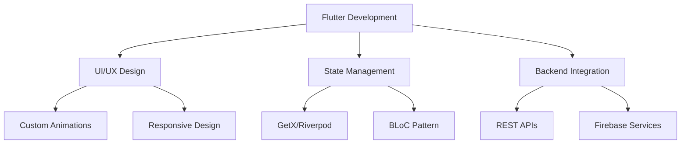

<!-- Animated Wave Header with Peaceful Colors -->


<p align="center">
  <a href="https://github.com/TejasSojitra12">
    
  </a>
</p>


<!-- Social Badges with Soft Colors -->
<p align="center">
  <a href="https://github.com/TejasSojitra12">
    
  </a>
  <a href="https://linkedin.com/in/TejasSojitra12">
    
  </a>
  <a href="mailto:tejas.sojitra@example.com">
    
  </a>
  <a href="https://twitter.com/TejasSojitra12">
    
  </a>
</p>

<!-- Profile Stats with Gradient -->
<p align="center">
  
  
  
</p>

---
### 🌟 About Me

<!-- About Me Section with Gradient Background -->
<!--  -->


``` dart
const tejas = {
  "pronouns": "He/Him",
  "code": ["Flutter", "Dart"],
  "askMeAbout": ["Mobile Dev", "Flutter", "Tech", "Architecture"],
  "technologies": {
    "mobile": {
      "native": ["Android"],
      "hybrid": ["Flutter"]
    },
    "backEnd": {
      "firebase": ["Firestore", "Auth", "Functions", "Storage"],
      "database": ["SQLite"]
    },
    "stateManagement": ["GetX", "BLoC"],
    "tools": ["Android Studio", "VS Code"],
    "architecture": ["Clean Architecture", "BLoC Pattern"]
  },
  "currentFocus": "Building scalable Flutter applications",
  "funFact": "I debug with coffee and solve problems with music 🎵"
};

```

---

## 🎨 Tech Stack & Tools

### 💜 Core Technologies
<div align="center">
  
| 📱 Mobile | 🎯 State Management | 🔧 Backend | 🛠️ Tools |
|:---------:|:------------------:|:----------:|:--------:|
|  |  |  |  |
|  | |  |  |
|  |  |  |  |

</div>

---

## 📈 GitHub Analytics

<div align="center">

  <!-- GitHub Stats and Top Languages -->
  <table>
    <tr>
      <td align="center">
        
      </td>
      <td align="center">
        
      </td>
    </tr>
  </table>

  <!-- GitHub Streak -->
  <br/>
  

</div>


---

## 🏆 GitHub Trophies

<div align="center">

 

</div>


---

## 📊 Contribution Graph

<div align="center">
  

</div>

---

## 💼 Professional Journey


<summary><b>🚀 Click to explore my Flutter expertise</b></summary>
<br>



### 🎯 Specialized Skills

- **🎨 UI/UX Excellence**
  - Custom animations with Hero & Rive
  - Material 3 Design implementation
  - Responsive layouts for all screen sizes
  
- **⚡ Performance Optimization**
  - 60+ FPS consistency
  - Memory leak prevention
  - Build size optimization
  
- **🔐 Security Implementation**
  - SSL Certificate pinning
  - Code obfuscation
  - Secure data storage


---

<!-- ## 🌈 Current Projects

<div align="center">
<table>
<tr>
<td width="50%">
<h3 align="center">Project Alpha</h3>
<div align="center">
<a href="https://github.com/TejasSojitra12/project-alpha" target="_blank">

</a>
<p>


</p>
<p>Enterprise-level mobile application with advanced features</p>
</div>
</td>
<td width="50%">
<h3 align="center">Project Beta</h3>
<div align="center">
<a href="https://github.com/TejasSojitra12/project-beta" target="_blank">

</a>
<p>


</p>
<p>Modern e-commerce platform with seamless UX</p>
</div>
</td>
</tr>
</table>
</div>

--- -->

## 🎯 2026 Goals

<div align="center">

| Quarter | Focus Area | Progress |
|---------|------------|----------|
| Q1 | Flutter Web Mastery |  |
| Q2 | Open Source Contributions |  |
| Q3 | Desktop App Development |  |
| Q4 | AI Integration in Flutter |  |

</div>

---

## 💭 Quote of the Day

<div align="center">
  
</div>

---

## 🤝 Let's Connect & Collaborate

<div align="center">
  
  <br>
  <b>I'm always excited to work on new projects and connect with fellow developers!</b>
  <br><br>
  
  [](https://linkedin.com/in/TejasSojitra12)
  [](mailto:tejas.sojitra@example.com)
  [](https://tejassojitra.dev)
  [](https://twitter.com/TejasSojitra12)
  
</div>

---

<div align="center">
  <br>
  <b>Thanks for visiting my profile! Have a great day! 😊</b>
  <br><br>
  
</div>

<!-- Footer Wave with Peaceful Colors -->

